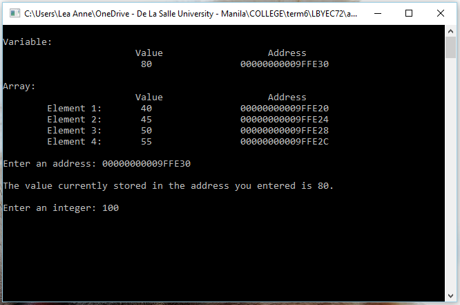

# lbyec72-ei2-p4-pointers-LeaRulloda
lbyec72-ei2-p4-pointers-LeaRulloda created by GitHub Classroom
###Lea Anne R. Rulloda - EI2
```
The program displays the initial values of the variable and the four-element array which I specified,
and their corresponding addresses. The user is asked to enter an address from the ones displayed.
```

```
The computer displays the current value stored in the address that was entered by the user.
The user is asked to input an integer.
```

```
The new value entered by the user is displayed along with its address that was also specified by the user.
The program asks if the user wants to run the program again.
```

```
The updated values are then displayed along with their corresponding addresses.
The user is asked again to enter an address. The current value of the entered address is displayed.
The user is asked to input an integer. The address and its new value are then displayed.
The program asks the user to repeat the process or not.
```

```
The process is repeated until all the variables are changed.
```


```
As you can see, all the values of the variable and the array are now changed and is displayed by the program.
```

```
If the user enters an invalid address, the program stops responding.
```

